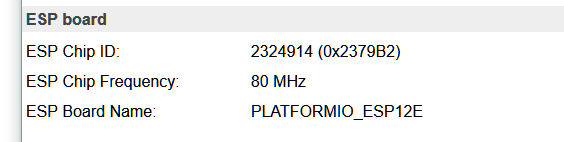
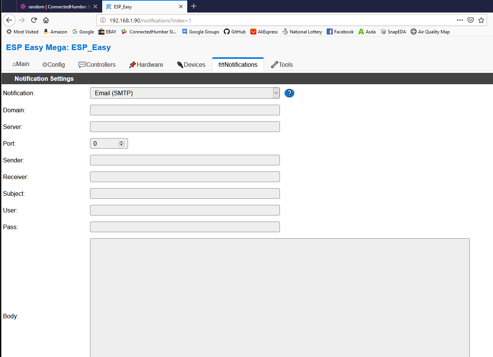

# ESPeasy Mega Initial Setup

Access to the WeMOS or nodeMCU is done via a web interface. Since my sensors are
in a box outside this saves some leg work. 

Initial setup
-------------

After flashing the WeMOS power it up then, using a Wi-Fi enabled device
(tablet/laptop) search for the ESP_EASY_0 network/access point and connect to it
(no password).

Then, open a web browser to 192.168.4.1 and choose your Wi-Fi network and enter
the password. press submit.

There will be a counter counting down as the WeMOS acquires a connection and IP
address – which will be displayed.

You can now disconnect your tablet/laptop and reconnect to your home network.

Use a web browser to browse to the IP address given earlier.

Uploading new Firmware can be done OTA from the Tools menu so you don't need to
re-flash with Esptool.

# Tools

Useful things here –

|  | comment |
|------------------------------------------|-------------------------------------------------------------------------------------------------------------------------------------------------------------------------------------------------------------------------------------------------------------------------------------------------------------------------------------------------------------------------------------------------------------------------------------------------------------------------------------------------------------------------|
|  | Tick the Rules checkbox – you will need them for publishing JSON in our format Check Use NTP to get the correct time                                                                                                                                                                                                                                                                                                                                                                                                    |
|  | Check the DST tick box to get the correct local time. The firmware seems to know about March/October changes in the UK. **Log Settings:** Syslog allows you to send log info to another machine. Serial Log Level lets you send log entries to, for example, Putty if you are connected via USB. Don’t forget to set the baud rate and Enable Serial Port Web Log level controls the output to the Tools-\>Log web page panel. Useful for debugging – if not debugging set them to None as that saves ram (apparently). |
|  | Since a lost Wi-Fi connection means you cannot access the device from a web browser ticking the “Restart WiFi Lost Conn” seems like a sensible thing to do.                                                                                                                                                                                                                                                                                                                                                             |

## Tools-\>Sys Info

This is where you can find the chip id we use in our JSON for the DEV value.
Conventionally we use the hex string in brackets.

## Config

Fairly obvious.

|  | comment |
|------------------------------------------|----------------------------------------------------------------------------------------------------------------------------------------------------------------------------------------------------------------------------------------------------------------------------------------------------------------------------------------------------|
|  | Unit name/number can be anything. Personally I have 3 units running. You can use the unit-name and number in the JSON sent to our broker or you can hard code in the rule used. If you enter a password you will be prompted to enter it after a period on no browser activity. The user name is Admin.                                            |
|  | I like to avoid DHCP in case the router changes the IP after a reboot. **Sleep Mode** Connect the GPIO16 pin to the RESET pin. Sleep awake time is how long the device wakes up for. With sensors needing 30s warmup it may be a good idea to set this to, say, 35s to allow the driver code to take readings. Max sleep time is just over 1 hour. |

# Controllers

These are used to publish to our broker. OpenHAB communicates with my local
Mosquito and Connected Humber no problem.

|  | comment
|-------|------|
|  | You can publish to 3 Brokers at the same time apparently.                                                                                                                                                                                                                                                                                   |
|  | There’s a long list of protocols. If publishing to Connected Humber change Locate Controller to ‘Use Hostename’ and enter mqtt.connectedhumber.org in the Controller IP field Then enter the Connected Humber user name and password here. You can obtain the username and password from other group members. I am not publicising it here. |

# Hardware

I like the way it warns you about using some GPIO pins.

|  | comment|
|------------------------------------------|----------------------------------------------------------------------------------------------------------------------------------------------------------------------------------------------------------------------------------------------------------------------------------------------------|
|  | If power consumption is a concern don’t select GPIO-\>LED. However, if you want to be sure the code is running during development then it’s useful but in a remote box it isn’t. It may be useful to set the GPIO states on boot up but be careful with D3,D4 and D8 as they affect the boot mode. |

# Devices

Each weMOS or nodeMCU can manage up to 12 devices. That only works if they are
I2C so I use separate WeMOS devices to give me Analog and Serial control of two
devices.

|  | comment |
|--------------------------------------------|---------------------------------------------------------------------------------------------------------------------------------------------------------------------------------------------------------------------------------------------------------------------------------------------------------------------------------------------------------------------------------------------------------------------------------------------------------------------------------------------------------------------------------------------------------------------------------------------------------------------------------------------------------------------------------------------------------------------------------------------------------|
|  | The PMSx003 isn’t in the normal build of ESP Easy. I have ‘self built’ ESP Easy Mega based on Mega 20190315 and re-written the PMSx003 driver to enable sleep/wake control similar to that of the SDS011 driver.                                                                                                                                                                                                                                                                                                                                                                                                                                                                                                                                        |
|  | The devices can be named however you like but the name matters when you use a rule to publish the readings as you will see later. The PMSx003 sensor has RX, TX and, optionally, a reset pin. The reset pin is toggled when the device is first enabled. For continuous use set the sleep time to 0 and the regular sensor readings will be updated in accordance with the Interval setting. For wake/sleep use set the interval time to about 5 seconds so that the sensor reading is sampled 6 times during the Waking period. The sensor can only deliver readings once per second max so there’s no point in setting the value that low. At the end of the waking period a \#Sleep rule event is triggered so you can read the last (stable) value. |
|  | Here you can select a name for your readings. For Connected Humber we only send pm2.5 and pm10.                                                                                                                                                                                                                                                                                                                                                                                                                                                                                                                                                                                                                                                         |

# Notifications

The options are Buzzer and Email – so I guess you could have it notify you via
an email address but I haven’t set this up to try it.

# Rules

Make sure you use Tools-\>Advanced and enable rules otherwise this menu option
does not appear.

This is a powerful tool. You can get stuff to happen when you want. There are 8
timers you can use.

I suggest you read this
<https://www.letscontrolit.com/wiki/index.php/Tutorial_Rules> after my brief
explanation.

| | comment |
|----------------------------------------------------------------------------------------------------------------------------------------------------------------------------------------------------------------------------------------------|-------------------------------------------------------------------------------------------------------------------------------------------------------------------------------------------------------------------------------------------------------------------------------------------------------------------------------------------------------------------------------|
|                                                                                                                                                                                                    | This is just a rule set being used for my development work. My new PMSx003 device driver (named PMS7003) issues a PMS7003\#Sleep event at the end of the 30s warmup period. This rule captures that event and publishes the readings to my local broker. It also adds an entry to the log file – only needed during testing. Sensor values are obtained using square brackets |
| on BME280\#Temperature do publish airquality/data,{"dev":"CHASN-084568-1","temp":[BME280\#Temperature], "humidity":[BME280\#Humidity], "pressure":[BME280\#Pressure], "timestamp":"%sysyear_0%-%sysmonth_0%-%sysday%T%systime%+01:00"} endon | This is the rule from my BME sensor device – sorry the text is folded. The rule is fired every time the BME280 temperature value is read. My BME device is on all the time and the interval is set to 360 seconds so this rule fires once every 6 minutes. It publishes the readings from the sensor.                                                                         |
| on System\#Boot do timerSet,1,5 end on on Rules\#Timer=1 do ….. do something here timerSet,1,360 endon                                                                                                                                       | These rules start timer 1 with a 5 second delay when the machine is rebooted. When timer 1 fires this event is triggered. The code could publish a set of readings like the BME above. It then sets timer 1 to fire again 6 minutes (360s) later , ad-infinitum.                                                                                                              |
